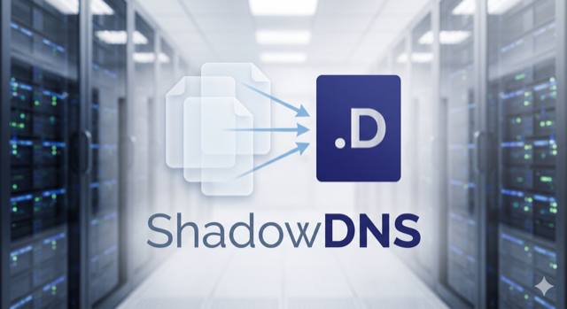

<p align="center">
  
</p>

# ShadowDNS

[](https://github.com/chenwei791129/ShadowDNS/actions/workflows/ci.yml)

An authoritative DNS server with first-class zone aliasing for memory-efficient backup-domain serving.

📖 **Manual**: [English](https://chenwei791129.github.io/ShadowDNS/) · [正體中文](https://chenwei791129.github.io/ShadowDNS/zh/)

## Why ShadowDNS?

Hosting many backup domains on BIND requires loading one complete zone copy per backup per view. In a typical split-horizon deployment with 3,000 backup domains across 7 views, that means roughly 21,000 redundant zone copies in memory — each backup a near-identical replica of its root domain, differing only in the zone name. At an average zone size of 10 KB, this accounts for approximately 210 MB of memory that carries no useful information.

ShadowDNS eliminates this waste through zone aliasing. Only root domains are fully loaded into memory. Backup domains are represented by a pointer to their root, and all queries against a backup zone are served on the fly via in-bailiwick rewriting: the answer looks exactly as if a complete backup zone had been loaded, but the server retains only one authoritative copy of the underlying data. In the reference deployment, this reduces memory usage by approximately 80% compared to the equivalent BIND master.

The design goal is transparent compatibility: clients querying backup domains see no difference in responses; existing BIND slaves continue to receive AXFR as before; and the management system that generates `named.conf` and zone files requires no changes. ShadowDNS reads your existing configuration files directly.

## How it works

```text
Client query
     |
     v
[ View Matcher ]
     |   Evaluates match-clients rules in declaration order (GeoIP country,
     |   GeoIP ASN, IP/CIDR, any). First match wins. Returns a view name.
     |
     v
[ Alias Resolver ]
     |   Checks whether the queried zone is a backup alias. If so, rewrites
     |   the query name from backup.domain to root.domain before lookup,
     |   and records the original backup name for the response.
     |
     v
[ Zone Lookup ]
     |   Finds the matching owner entry in the selected view's in-memory
     |   zone tree (a map[ownerName][]RR). O(1) lookup per owner name.
     |   If no exact match is found, wildcard matching per RFC 4592 is
     |   attempted: labels are stripped left-to-right until a `*.<parent>`
     |   entry is found or an existing name blocks the search (ENT rule).
     |
     v
[ In-Bailiwick Rewrite ]
     |   Rewrites owner names back to the backup domain. For RDATA fields
     |   that contain a DNS name (CNAME target, NS, MX, SRV, SOA MNAME/
     |   RNAME): if the target points into the root zone, it is rewritten to
     |   the backup zone. Targets pointing elsewhere (e.g., a third-party
     |   CDN hostname) are preserved unchanged.
     |
     v
Response sent to client
```

**View Matcher**: Each view's `match-clients` block is compiled into an ordered rule slice at startup. Rules are evaluated left to right; the first rule that matches the client's source IP determines the view. If no view matches, the server returns REFUSED. GeoIP lookups use MaxMind's mmdb format read directly into memory; the mmdb files are re-opened on every SIGHUP reload, so MaxMind's monthly updates take effect without a process restart.

**Alias Resolver**: At query time, the resolver performs a longest-suffix match against the alias map (built from the `aliases` section of `shadowdns.yaml` at startup). A backup zone entry is a thin pointer — the resolver strips the backup suffix, replaces it with the root suffix, and hands the rewritten name to the zone lookup. The original backup name is retained so the rewrite stage can restore it.

**Zone Lookup**: Zone data is stored as `map[viewName]map[zoneName]*Zone`. Each `Zone` holds a `map[ownerName][]dns.RR`. All structures are read-only after startup; no locking is required on the read path. When an exact match returns no records, the server falls back to wildcard matching per RFC 4592: it strips one DNS label at a time from the query name and probes for a `*.<parent>` entry in the map, stopping at the zone origin or at an existing name that blocks further traversal (the empty non-terminal rule). Backup override records (TXT, MX, SRV from a backup zone's own file, if provided) are stored separately and merged in after the root lookup.

**In-Bailiwick Rewrite**: The rewrite rule is intentionally conservative. Owner names are always rewritten (they are always in-bailiwick by definition). RDATA names are rewritten only when they point into the root zone — ensuring that the rewritten name will also resolve correctly through the same alias mechanism. A/AAAA records carry IP addresses and are never rewritten. TXT RDATA is opaque and is never rewritten, even if it contains a string that matches the root domain name.

## Compatibility with BIND

### Supported

- **BIND `named.conf` drop-in** — point `--named-conf` at an existing `/etc/bind/named.conf` (Debian-idiomatic `include` split and all) and ShadowDNS loads it directly. Constructs ShadowDNS does not act on are handled under a tiered tolerance contract (silent / INFO / WARN / fail-closed): unsupported zone types and recursion/DNSSEC directives are skipped and logged, not fatal, so a real BIND config still starts. Access control is governed by a fail-closed doctrine — an unevaluable `match-clients` element matches nothing rather than everyone. See [docs/migration.md](docs/migration.md) and [docs/configuration/named-conf.md](docs/configuration/named-conf.md)
- `named.conf` options block (`directory`, `geoip-directory`, `listen-on`, `listen-on-v6`, `allow-transfer`, `recursion`, `minimal-responses`, `version`, `hostname`, `transfer-format`, `notify`)
- `listen-on { any; }` and explicit IPv4 address lists from `named.conf` are honored via per-address binding. Individual bind failures (e.g. a `127.0.0.x` alias occupied by `systemd-resolved`) log a warning and are skipped; the server starts as long as at least one listener binds. See [docs/migration.md](docs/migration.md) for the precedence rules between `--listen` and `listen-on`
- `listen-on-v6` from `named.conf` drives IPv6 listeners using the same per-address binding model as IPv4. Supported tokens: `any` (enumerates local IPv6 interface addresses, excluding link-local `fe80::/10` addresses that require a zone index, but including loopback `::1`), `none`, and explicit IPv6 address literals (e.g. `2001:db8::1`). IPv6 is opt-in: an absent `listen-on-v6` stanza yields no IPv6 listener, keeping IPv4-only deployments unchanged. Unsupported tokens (IPv4 literals, exclusion `!addr`, ACL names, `port N`) are logged at WARN and skipped non-fatally. `--listen` accepts IPv6 bracket literals (e.g. `[::1]:5353`); with the `:PORT` short form the resolved listener set is the union of `listen-on` (IPv4) and `listen-on-v6` (IPv6) addresses, IPv4 first
- `view "<name>" { match-clients { ... }; ... }` with first-match semantics
- `match-clients` rule types: `geoip country <ISO-2>`, `geoip asnum "AS<N> <description>"`, bare IPv4 address, IPv4 CIDR prefix, `any`
- Wildcard record matching per RFC 4592 — closest-encloser algorithm with empty non-terminal (ENT) blocking, CNAME wildcard synthesis, and correct owner name rewriting in responses
- Zone files in RFC 1035 master file format (`$TTL`, `$ORIGIN`, `@`, multi-line `(...)`, `;` comments)
- `$INCLUDE` / `$include` directive with both bare path (`$include /path/to/file`) and BIND-style double-quoted path (`$include "/path/to/file"`); the directive name is case-insensitive. Limitations: the path itself MUST NOT contain whitespace (a fundamental miekg/dns scanner limit, not lifted by quoting), and the quoted form is recognised only on the top-level zone file — fragments pulled in via `$INCLUDE` are read directly by the underlying parser and must use the bare form internally
- `type master;` zones
- AXFR (full zone transfer over TCP) for both root zones and alias zones
- NOTIFY outbound to slave nameservers on startup and after reload (can be disabled via `--no-notify` CLI flag or `options { notify no; };`)
- `allow-transfer` ACL enforcement
- Split-horizon responses (different answers per view for the same query)
- SOA inheritance for backup zones (serial tracks the root zone; slaves detect changes correctly)
- BIND9-compatible query logging — parses the standard `logging{}` block (`channel` with `file`/`severity`/`print-*` plus `category queries`) and appends one line per view-matched query in BIND's exact queries-category format, so existing downstream log parsers keep working unchanged. Rotation is handled by logrotate + SIGUSR1 (BIND's built-in `versions`/`size` parameters are ignored with a warning); the file reopens alongside `--log-file` on SIGUSR1. SIGHUP reload re-applies `logging{}` changes — path and `print-*` option edits take effect without a restart, and SIGUSR1 reopen semantics are unchanged
- EDNS0 OPT echo (RFC 6891) — responses to EDNS queries carry an OPT record (version 0, 1232-byte UDP payload size per DNS Flag Day 2020); unsupported EDNS versions receive BADVERS
- DNS Cookies (RFC 7873, answer-only) — queries carrying a COOKIE option receive a full cookie in the response (client cookie echo + server cookie in the RFC 9018 interoperable format, SipHash-2-4). The 128-bit secret is generated at startup, held in memory only, and survives SIGHUP reloads. Cookies are never required: there is no enforcement mode and BADCOOKIE is never returned; malformed COOKIE options get FORMERR per RFC 7873 §5.2.2. Matches BIND 9.11+ default behavior
- EDNS Client Subnet (ECS, RFC 7871) — opt-in via `--ecs-enable` (default off). When enabled, a valid ECS option drives GeoIP view selection (country/ASN rules) instead of the resolver's source IP, improving geo accuracy for queries arriving via public resolvers; IP/CIDR ACL rules always evaluate the real source IP, so a forged ECS option can never select an ACL-protected view. Responses echo the ECS option with a scope equal to the source prefix length, and client opt-out (source prefix length 0) is honored. When disabled, ECS options in queries are ignored and responses never carry one — matching BIND, which does not support ECS
- CNAME chain collapsing — opt-in per alias group (`collapse_cname_chain`, default off). When enabled, responses consume in-zone CNAME chains instead of emitting them, hiding intermediate names (internal load balancers, pools) from clients: a chain ending at records of the queried type returns only those final records (owner = query name, TTL = chain minimum); a chain leaving the zone returns a single synthesized CNAME pointing at the first external target; a chain ending without the queried type returns NODATA. Backup members inherit the root's setting; AXFR always carries the raw chain. With the flag off, chain emission is byte-identical to BIND

### Planned

- In-bailiwick CNAME Flattening — resolve an apex CNAME whose target points into a zone ShadowDNS already serves, returning A/AAAA directly so a CNAME can coexist with SOA/NS at the zone apex. Resolution is an in-memory lookup in the client's matched view — no outbound resolver, mirroring the in-zone-glue model used for NOTIFY. Targets resolving outside any ShadowDNS-served zone are refused

### Not supported

- DNSSEC — not planned; signing conflicts with zone aliasing (RRSIG owner names cannot survive on-the-fly rewriting) and ephemeral records (TTL-0 records injected at runtime cannot be pre-signed)
- IXFR (incremental zone transfer) — not planned; slaves receive a full AXFR on each NOTIFY, which is the protocol-defined fallback per RFC 1995
- Dynamic Update (RFC 2136) — not planned; all record changes go through zone file edits and reload
- CNAME Flattening with out-of-bailiwick (external) targets — not planned; resolving an arbitrary external target (e.g. a third-party CDN hostname) at query time requires an outbound recursive path, which conflicts with the authoritative-only, `recursion no` design and degrades GeoIP accuracy (the target is resolved from the server's location, not the client's). Only the in-bailiwick subset is planned (see above); for external apex targets, RFC 9460 HTTPS/SVCB records are the standards-track alternative
- Recursion — ShadowDNS is authoritative-only; `recursion no` is always in effect
- `type slave` or `type forward` zones — not served; tolerated on load (the zone is dropped and logged at INFO rather than failing startup, so a mixed BIND config still loads)
- `allow-update`, `dnssec-enable` directives — not acted on; tolerated on load (skipped and logged rather than rejected). Note: `allow-update` is logged at WARN under the access-control tier, `dnssec-enable` is skipped silently

### Feature comparison

| Feature                            | BIND (master) | ShadowDNS  |
|------------------------------------|---------------|------------|
| BIND `named.conf` drop-in          | Native        | Yes        |
| RFC 1035 zone file parsing         | Yes           | Yes        |
| Split-horizon views                | Yes           | Yes        |
| GeoIP country match                | Yes           | Yes        |
| GeoIP ASN match                    | Yes           | Yes        |
| IP / CIDR match                    | Yes           | Yes        |
| AXFR                               | Yes           | Yes        |
| NOTIFY                             | Yes           | Yes        |
| Wildcard records (RFC 4592)        | Yes           | Yes        |
| Zone aliasing (backup domain)      | No            | Yes        |
| Hot reload (SIGHUP)                | Yes           | Yes        |
| Prometheus metrics                 | No            | Yes        |
| IXFR                               | Yes           | No         |
| DNSSEC                             | Yes           | No         |
| IPv6 listener                      | Yes           | Yes        |
| DNS Cookies (RFC 7873)             | Yes           | Yes        |
| Response Rate Limiting (RRL)       | Yes           | Yes        |
| EDNS Client Subnet (ECS, RFC 7871) | No            | Yes (opt-in via `--ecs-enable`, default off) |
| Query logging (BIND format)        | Yes           | Yes        |
| CNAME Flattening (external target) | No            | No         |
| In-bailiwick CNAME Flattening      | No            | Planned    |
| Dynamic Update                     | Yes           | No         |
| Recursion                          | Configurable  | Always off |

#### Response Rate Limiting (RRL) — v1 scope

RRL is configured via a BIND-compatible `rate-limit { ... }` block inside the global `options` scope only. A `rate-limit` block placed inside a `view` block is warned and ignored (per-view rate limiting is not supported in v1).

RRL applies to **UDP responses only**; TCP responses are never rate-limited.

Supported sub-options (defaults align with BIND):

| Sub-option            | Notes                                                                                         |
|-----------------------|-----------------------------------------------------------------------------------------------|
| `responses-per-second`  | Max response rate per client prefix                                                         |
| `referrals-per-second`  | Parsed for BIND compatibility; never triggers (ShadowDNS is authoritative-only and emits no referral responses) |
| `nodata-per-second`     | Max NODATA response rate                                                                    |
| `nxdomains-per-second`  | Max NXDOMAIN response rate                                                                  |
| `errors-per-second`     | Max error response rate (SERVFAIL, REFUSED, etc.)                                           |
| `all-per-second`        | Global cap across all response categories                                                   |
| `window`                | Tracking window in seconds                                                                  |
| `slip`                  | Fraction of rate-limited responses answered with a truncated reply instead of dropped       |
| `ipv4-prefix-length`    | IPv4 prefix length for client grouping                                                      |
| `ipv6-prefix-length`    | IPv6 prefix length for client grouping                                                      |
| `exempt-clients`        | ACL of clients exempt from rate limiting                                                    |
| `log-only`              | Log drops without actually dropping responses                                               |
| `max-table-size`        | Maximum number of tracked client prefixes                                                   |
| `min-table-size`        | Minimum table allocation size                                                               |

`qps-scale` is **not supported** — it is warned and ignored.

## Quick start

**1. Install Go 1.26+ and clone the repository.**

```bash
git clone https://github.com/example/shadowdns.git
cd shadowdns
```

**2. Build the binary.**

```bash
make build
```

The binary is written to `bin/shadowdns-<GOOS>-<GOARCH>` (e.g., `bin/shadowdns-linux-amd64` on Linux/amd64, `bin/shadowdns-darwin-arm64` on Apple Silicon).

**3. Place GeoIP databases in your GeoIP directory (only if views use `geoip` rules).**

ShadowDNS reads the directory from `geoip-directory` in `named.conf` (e.g., `/usr/local/share/GeoIP/`). When `geoip-directory` is set, the following files must be present:

```text
/usr/local/share/GeoIP/GeoLite2-Country.mmdb
/usr/local/share/GeoIP/GeoLite2-ASN.mmdb
```

Download these from [MaxMind](https://dev.maxmind.com/geoip/geolite2-free-geolocation-data). ShadowDNS will refuse to start if either file is missing. If no view uses `geoip country` / `geoip asnum` rules, leave `geoip-directory` unset and skip this step — ShadowDNS starts without any mmdb files.

**4. Run ShadowDNS.**

Use the host-specific binary path from step 2; the example below assumes `linux/amd64`.

```bash
./bin/shadowdns-linux-amd64 \
    --named-conf /etc/bind/named.conf \
    --config     /etc/bind/shadowdns.yaml
```

ShadowDNS listens on `:53` (UDP and TCP) by default. Use `--listen` to override.

## Configuration

### Command-line flags

| Flag              | Default | Required | Description                                              |
|-------------------|---------|----------|----------------------------------------------------------|
| `--named-conf`    | —       | Yes      | Path to `named.conf`. The `geoip-directory` option inside this file controls where mmdb files are read from. |
| `--config`        | —       | Yes      | Path to the unified ShadowDNS YAML config (`aliases` + `ephemeral_api` sections). See schema below. |
| `--listen`        | `:53`   | No       | UDP/TCP listen address. Accepts any `host:port` form.    |
| `--metrics-addr`  | `:9153` | No       | Prometheus `/metrics` HTTP listen address. Empty string disables. |
| `--pprof-enable`  | `false` | No       | Expose Go pprof profiling endpoints under `/debug/pprof/` on the metrics HTTP server. Requires `--metrics-addr` to be non-empty. Read only at startup — SIGHUP reload does not change its value; restart the process to toggle. **Only enable on a trusted network or with a loopback/localhost bind**: pprof has no authentication, returns debugger-grade runtime state, and the CPU/trace profile endpoints can be used to stall the process for the requested duration. |
| `--dry-run`       | `false` | No       | Load configuration and zones, log a summary, then exit without starting listeners. |
| `--no-notify`     | absent  | No       | Disable NOTIFY dispatch for the entire process lifetime. When omitted, NOTIFY follows `options.notify` in `named.conf` (default: enabled). When passed, overrides the config directive; sticky across SIGHUP reloads. |
| `--no-color`      | `false` | No       | Force uncolored log output regardless of terminal detection. Honors the `NO_COLOR` environment variable (https://no-color.org); non-TTY stderr is also detected automatically and disables color. |
| `-v`, `--version` | `false` | No       | Print version and exit.                                  |

### Subcommands

| Subcommand                                                                             | Description                                           |
|----------------------------------------------------------------------------------------|-------------------------------------------------------|
| `shadowdns reload --named-conf <path>`                                                 | Send SIGHUP to the server identified by the pid-file configured in `named.conf`. Accepts only `--named-conf`; server-startup flags are rejected. |
| `shadowdns prune-backup --named-conf <path> --config <path> [--apply]`                 | Offline diff of backup zone files against their aliased root zones; reports redundant records (dry-run by default) and rewrites them when `--apply` is supplied. Does not open sockets and does not signal the running server. |

`prune-backup` compares each `(view, backup-zone)` pair declared in
`named.conf` against its root counterpart from the same view. Non-overridable
record types (everything except `TXT`/`MX`/`SRV`) are always flagged; for
overridable types, an entire RRSet is flagged only when it matches the root
RRSet exactly (ignoring TTL and order). `SOA` and the apex `NS` RRSet are
always retained so the zone file stays RFC 1035 valid. On `--apply`, each
rewritten file is atomically replaced and the pre-change copy is kept at
`<path>.bak`. Example dry-run:

```bash
shadowdns prune-backup \
    --named-conf /etc/shadowdns/named.conf \
    --config /etc/shadowdns/shadowdns.yaml
```

### shadowdns.yaml schema

`shadowdns.yaml` is a single YAML document with two optional top-level sections:
`aliases` (backup → root map) and `ephemeral_api` (HTTP API for short-lived TXT
records). Any other top-level key is rejected at startup (strict decoding).

```yaml
# shadowdns.yaml

aliases:
  example.com:
    - backup-example.com
    - mirror-example.com
  another-root.com:
    - backup-another.com

ephemeral_api:
  listen: "127.0.0.1:8053"
  allow:
    - "127.0.0.1"
    - "10.0.0.0/8"
  # token: "optional-bearer-token"
```

`aliases` rules:
- Each key is a root domain; the value is a list of its backup domains.
- A backup domain may appear at most once across all roots (after normalization).
- A backup domain cannot equal its root (self-alias is rejected).
- Domains not listed here are treated as independent root zones and are loaded in full.
- Backup zones may optionally provide their own zone file containing TXT, MX, or SRV override records. A, AAAA, CNAME, NS, and SOA records in a backup zone file are discarded with a warning — those record types are always inherited from the root.

`ephemeral_api` fields:
- `listen` (required) — `host:port` the API server binds to.
- `allow` (required, non-empty) — list of source IPs or CIDR ranges permitted to reach the API. Empty list is rejected.
- `token` (optional) — pre-shared bearer token. When set, every request must include `Authorization: Bearer <token>`. When omitted, token validation is skipped (IP ACL still applies).

When the `ephemeral_api` section is absent, no HTTP API server is started. See [docs/ephemeral-api.md](docs/ephemeral-api.md) for endpoint details, request/response schemas, and `curl` examples.

SIGHUP reload re-reads `shadowdns.yaml` and swaps the in-memory alias map
atomically — if any section fails validation the running server keeps its
previous state and ephemeral records are preserved. On successful reload the
ephemeral record store is cleared. Every reload attempt is observable via
Prometheus: `shadowdns_reload_total{result="success"|"failure"}` counts
outcomes, and `shadowdns_config_last_reload_success_timestamp_seconds` carries
the Unix time of the most recent successful configuration load (initialised at
startup), enabling `time() - <gauge>` staleness alerts.

> **Breaking change since v0.x:** the previous `--aliases` CLI flag and
> `aliases.yaml` file have been removed. Migration is mechanical: take the
> entries from the old `aliases.yaml` (root → [backups] format) and move them
> under the `aliases:` section of the new `shadowdns.yaml`.

### GeoIP databases

The `geoip-directory` option in `named.conf` specifies where ShadowDNS looks for mmdb files. It is optional: when it is unset (absent or empty), no mmdb files are loaded, and startup fails only if some view's `match-clients` uses `geoip country` / `geoip asnum` rules (the error names the first offending view with its source file and line). When `geoip-directory` is set, both files are required:

| File                       | Used for                    |
|----------------------------|-----------------------------|
| `GeoLite2-Country.mmdb`    | `geoip country` rules       |
| `GeoLite2-ASN.mmdb`        | `geoip asnum` rules         |

ShadowDNS uses the same data source as BIND's `geoip` module, so GeoIP view assignment will be consistent when running both systems in parallel during migration. The databases are re-opened on every SIGHUP reload — drop in MaxMind's monthly update and send SIGHUP; the `shadowdns_geoip_db_info` gauge reflects the new `build_time` after a successful reload.

### named.conf example

ShadowDNS reads the Debian/Ubuntu BIND include split. The top-level
`named.conf` only pulls in the options and local files; `named.conf.options`
holds the global `options {}` block, and `named.conf.local` holds the
`view {}` blocks. `/etc/bind` is the Debian-idiomatic location for the
configuration and the authoritative zone files that sit alongside it.

`named.conf`:

```text
include "named.conf.options";
include "named.conf.local";
```

`named.conf.options`:

```text
options {
    directory           "/etc/bind";
    geoip-directory     "/usr/local/share/GeoIP/";
    listen-on           { any; };
    listen-on-v6        { none; };
    recursion           no;
    minimal-responses   yes;
    version             none;
    hostname            none;
    allow-transfer      { 192.0.2.10; 192.0.2.11; };
};
```

`named.conf.local`:

```text
view "view-th" {
    match-clients { geoip country TH; };
    zone "example.com" {
        type master;
        file "db.example.com-th";
    };
};

view "view-other" {
    match-clients { any; };
    zone "example.com" {
        type master;
        file "db.example.com-other";
    };
};
```

## Project status

ShadowDNS v1 is a foundation implementation. The config loader, zone parser, view matcher, alias resolver, DNS server, zone transfer, and integration test suite are complete.

This software has not yet been deployed to production. Integration testing against a production-scale dataset (12,000+ zone files across 7 views) is planned before any production cutover. See the full architectural decisions and four-phase migration plan at [openspec/changes/shadowdns-foundation/design.md](openspec/changes/shadowdns-foundation/design.md).

Design decisions:

- IXFR is intentionally not supported; slaves perform a full AXFR on each NOTIFY (RFC 1995 fallback).

## Pre-deployment Checklist

The following items are open questions from [design.md](openspec/changes/shadowdns-foundation/design.md) that **must be verified by ops** before switching production traffic to ShadowDNS.

### 1. `view-other` must be the last view in match-clients order

ShadowDNS uses first-match semantics (identical to BIND). Any view whose `match-clients` block contains `any;` will match **every** client. If such a view appears before a more-specific view (e.g., `view-th` with GeoIP rules), the GeoIP view will never be reached — all traffic will fall into the `any` view.

**Required action**: confirm that the view whose `match-clients` is `any;` is declared **last** in `named.conf.local`. ShadowDNS will log a warning at startup if a non-last view uses `any`, but this does not prevent startup.

### 2. ASN description string format must match the parser expectation

`match-clients` rules of the form `geoip asnum "AS64500 Test ASN"` are parsed by extracting the leading numeric component (the regex `^AS(\d+)\s`). The description text after the space is ignored. This means:

- `"AS64500 Test ASN"` and `"AS64500 Any Description"` both match ASN 64500.
- If a rule string does **not** start with `AS` followed by digits and a space (e.g., `"64500"` without the `AS` prefix), the parser will fail at startup with an error.

**Required action**: verify that all `geoip asnum` entries in your `named.conf.local` follow the `"AS<number> <description>"` format before deploying. Cross-check with the actual strings in your `named.conf.local` generated by the management system.

### 3. Run `--dry-run` against production config before cutover

```bash
make build

./bin/shadowdns-linux-amd64 \
    --named-conf /etc/bind/named.conf \
    --config     /etc/bind/shadowdns.yaml \
    --dry-run
```

A successful exit (code 0) confirms that every zone file parses without error and the GeoIP databases are readable. See [docs/benchmark.md](docs/benchmark.md) for memory profiling guidance.

### 4. NOTIFY outbound targets

ShadowDNS sends NOTIFY to the NS records of each zone (BIND default behaviour).

**Glue-only target resolution.** The destination IP for every NOTIFY is taken **exclusively from in-zone glue records** — the A and AAAA records for the NS target name that live inside the same zone file. ShadowDNS does not consult `/etc/resolv.conf`, does not perform recursive lookups, and does not cross-reference other loaded zones when resolving NS target names. This matches BIND9's NOTIFY behaviour and prevents the system resolver from being invoked on hosts that have no outbound DNS path.

Implications:

- NS targets with multiple in-zone glue addresses (A + AAAA, or several A records) receive one NOTIFY per IP. Each `(zone, NS-hostname, IP)` tuple is dispatched independently and deduplicated across views.
- NS targets **without** in-zone glue — typically out-of-bailiwick NS records pointing to a hostname owned by a different zone — are **skipped**. No NOTIFY is built, no goroutine is spawned, and no fallback resolution is attempted. A single DEBUG log line is emitted per skipped target: `NOTIFY skipped: no in-zone glue` with field `source="skipped-no-glue"`.
- Glue-driven NOTIFY logs (per-attempt warnings and final failures) carry field `source="glue"`, letting operators distinguish glue-driven sends from skipped targets in a single grep.

If your deployment requires reaching slaves whose addresses cannot be expressed as in-zone glue (e.g. out-of-bailiwick secondaries), an explicit `also-notify` directive is the right tool — that capability is on the future-work list and is intentionally not implemented via system-resolver fallback, since that path was the root cause of the noisy startup timeouts this change addresses.

**Disabling NOTIFY.** Single-server deployments without secondaries, or test environments where startup noise is unwanted, can disable NOTIFY via either:

- CLI flag: `shadowdns --no-notify ...` — applies for the process lifetime and persists across SIGHUP reloads even if `named.conf` later enables NOTIFY
- Config directive: `options { notify no; };` — applies at load time; changes take effect on SIGHUP reload

When NOTIFY is disabled, ShadowDNS builds no NOTIFY messages, spawns no goroutines, and performs no retries. A single INFO log line records the resolved state and its source at startup and after each reload: `notify state resolved enabled=<bool> source=<flag|config|default>`.

**Precedence.** When both the flag and the config directive are set, the rules are:

1. Explicit `--no-notify` flag → NOTIFY disabled for the process lifetime
2. Otherwise, `options.notify` from `named.conf` wins (`yes` or `no`)
3. Otherwise, NOTIFY defaults to enabled (preserving pre-existing behaviour)

The flag is intentionally "set-only" — `--no-notify` can only disable NOTIFY. To enable NOTIFY when previously disabled, restart the process without the flag. This avoids the confusion of a double-negative "--no-notify=false" appearing to force-enable NOTIFY.

## License

[MIT](LICENSE) © 2026 Chen-Wei Sun
